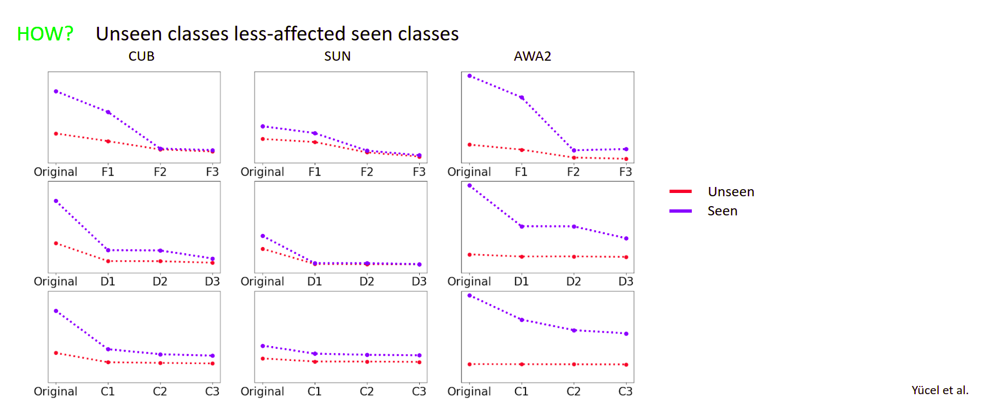
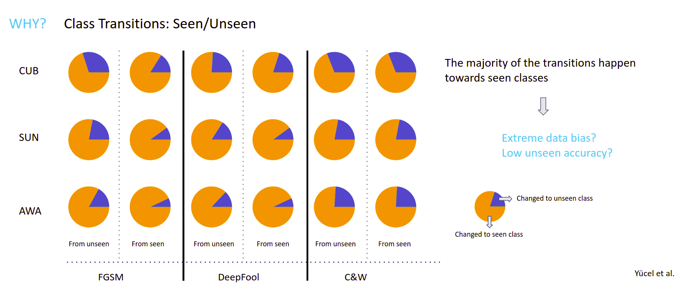

# A Deep Dive into Adversarial Robustness in Zero-Shot Learning

This repository contains the PyTorch implementation of our paper [A Deep Dive into Adversarial Robustness in Zero-Shot Learning](https://arxiv.org/abs/2008.07651) presented at [ECCV 2020 Workshop on Adversarial Robustness in the Real World](https://eccv20-adv-workshop.github.io/)


## Paper Highlights
In this paper, we investigate if Zero-Shot Learning models differ from supervised models from an adversarial robustness perspective. We leverage a widely-used ZSL model and subject it to several attacks/defenses, and then analyse our results. Our results show interesting trends, such as 



unseen/seen classes being effected disproportionately and


attacks increasing the accuracy values Our analysis finds interesting facts, such as 


a strong trend of class transitions towards seen classes and other notable trends. Refer to our paper for more details.


## Repository Contents and Requirements
This repository contains the pretrained models (under `/model` folder) and the code to reproduce our results. The code has been tested with Python 3.7.5, PyTorch 1.3.1, torchvision 0.4.2,  [Adversarial Robustness Toolbox 1.0.1](https://github.com/Trusted-AI/adversarial-robustness-toolbox), numpy 1.17.4, sklearn 0.22,  scipy 1.3.2 and PIL 6.2.1 on an Ubuntu 18.04.4 LST machine. In order to run the code, you need to download [AWA2](https://cvml.ist.ac.at/AwA2/), [SUN](http://cs.brown.edu/~gmpatter/sunattributes.html) and [CUB](http://www.vision.caltech.edu/visipedia/CUB-200-2011.html) datasets (raw images). Moreover, for data splits/attributes, download the zip file found [here](https://drive.google.com/file/d/1jk2wWtXavjizjvRFTt4OKBMyHKZBPm9v/view?usp=sharing) and extract the contents into `/data` folder. 

Code in this repository lets you run attack/defense settings reported in our paper on our pretrained models. Feel free to test with your pretrained models and/or with new attacks/defenses!


## Running the code
After you've downloaded the necessary dataset files, you can run the code by simply

```bash
python run.py
```

For changing the experimental parameters, refer to params.json file. Details on json file parameters can be found in the code. By default, running `run.py` looks for a `params.json` file in the folder. If you want to run the code with another json file, use

```bash
python run.py --json_path path_to_json
```

## Citation
If you find our code or paper useful in your research, please consider citing our paper (will be updated with ECCV bibtex)

```
TODO

```
## Acknowledgements
This code base has borrowed several implementations from this [link](https://github.com/cetinsamet/attribute-label-embedding-old)

